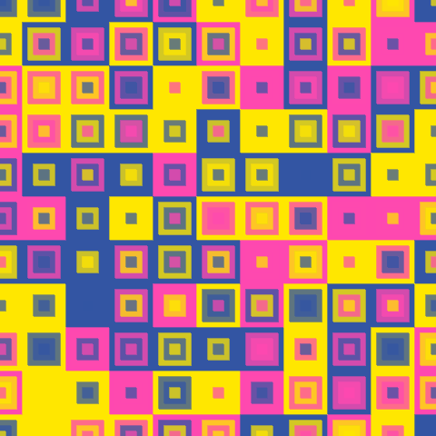
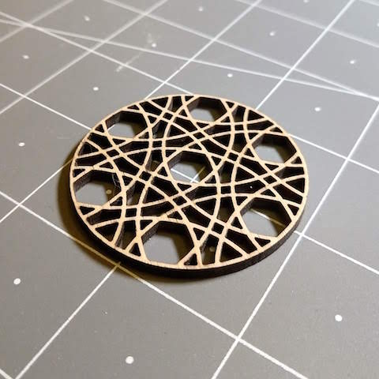
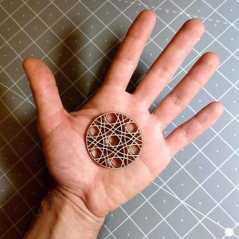
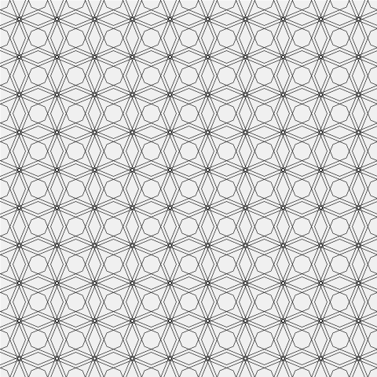
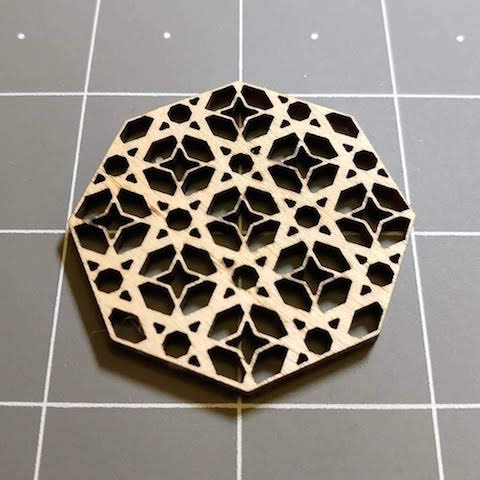
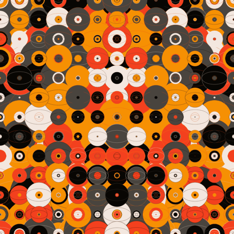

Hi there! I'm an artist and maker living in Los Angeles, you can visit my main website at [wolfCatWorkshop.com](https://wolfcatworkshop.com). 

This is a collection of sketches where I explore coding that creates images I find interesting. I'm not an expert so [comments and suggestions](https://wolfcatworkshop.com/index.php/contact/) are always welcome. 

## Makevember Sketches

Makevember is a challenge to make one thing everyday in November. There is a longer [manifesto](https://www.bricolage.run/blog/2018/10/31/makevember-manifesto-2018) you should read but in short it proposes:

> **Every day in November make a thing** – if you can’t do it every day then do what you can, but the idea is to push yourself to work daily   and with less procrastination. Do not attempt to put your ducks in a row first.

In 2017 I made a bunch of little handcranked machines I documented [here](https://wolfcatworkshop.com/index.php/portfolio/one-month-small-machines/) but in 2018 I wanted to get a little bit out of my confort zone and explore some creative coding. You can also find some of these images and what I did with them on my [twitter](https://twitter.com/wolfCatWorkshop) or [instagram](https://www.instagram.com/wolfcatworkshop/).

I'm only posting screen grabs here so click on the image or link to see the actual sketch.

### Day 1
[](./makevember/day-1/)

[sketch](./makevember/day-1/)

A simple set of overlaping grids, the color palette here is inspired by old school risographs. I also drew a second shape with a slight offset and transparency to simulate the charming missalignment of those machines. 

```js
//palette
yellow          = color(255, 232,   0);
mediumBlue      = color( 50,  85, 164);
fluorescentPink = color(255,  72, 176);
```


### Day 2
[](./makevember/day-2/)

[sketch](./makevember/day-2/)

I struggled a bit with the bezierVertex function to make the blinking eyelids, but I did it at the end. The palette was inspired by baby mario from "Super Mario World 2: Yoshi's Island", I found [this](https://www.instagram.com/p/BgCcOKAlmog/) color wheel on the [gamecolor wheel](https://www.instagram.com/gamecolorwheel/) instagram account.  

```js
//palette
brown      = color('#49443e'); 		
blackish   = color('#080603');		
redOrange  = color('#f4401e');		
darkOrange = color('#f69004');	  
offWhite   = color('#f3e7df');	  
```

### Day 3
[](./makevember/day-3/)

[sketch](./makevember/day-3/)

My gif export was a little clunky, check out the [sketch page](./makevember/day-3/) for a better experience. I started by trying to recreate the classic [overlapping circle pattern](https://en.wikipedia.org/wiki/Overlapping_circles_grid) on a hexagonal grid but when I started changing the radius of the circles crazy patterns started showing up. So I added a little slider to navigate them by multiplying the radius by a certain amount. The starting point of 1 is with the circles tightly packed on the hexagonal grid, but this is an arbitrary choice on my part. 

As a bonus I ended up laser cutting my favorite variation (radius multiplier 2.5), here is an [SVG file](./images/day-3.svg) if you are interested in cutting your own. 

[](https://www.instagram.com/p/Bpvq0yYAtZ1/)
[](https://www.instagram.com/p/Bpvq0yYAtZ1/)

### Day 4
[](./makevember/day-4/)

[sketch](./makevember/day-4/)

A simple pattern navigator that works by placing polygons on a square grid. You can change the radius and the number of sides with some sliders. I wanted to add SVG export so I'm using [this p5 SVG library](https://github.com/zenozeng/p5.js-svg), it requires and older version of p5js so I couldn't use the same technique for placing the SVG canvas inside a DIV that I used on the other sketches so the page doesn't look as neat, but the SVG download works. 

I think the most amusing patterns are made by the octagons. Polygons with a larger number of sides are very close to a circle, and some of the other ones like triangles and hexagons probably look better on a hexagonal grid. 

I also cut something with my favorite variation, here is an [SVG file](./images/day-4.svg) for this one.

[](https://www.instagram.com/p/BpyAJbUA5lN/)


### Day 5
[](./makevember/day-5/)

[sketch](./makevember/day-5/)

I wanted lots of eyes. I think a sort of monster is kind of taking shape everytime you redraw the canvas. Same palette as day 2.

```js
//palette
brown      = color('#49443e'); 		
blackish   = color('#080603');		
redOrange  = color('#f4401e');		
darkOrange = color('#f69004');	  
offWhite   = color('#f3e7df');	  
```

### Day 6
[](./makevember/day-6/)

[sketch](./makevember/day-6/)

Another "pattern explorer" with just radial symmetry and ellipses. This time I used the [quicksettings library](https://github.com/bit101/quicksettings) for the user interface, boy does it make life easy if you want lots of sliders and buttons, it looks fairly clean too. 
