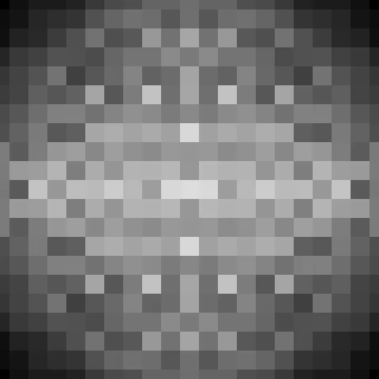
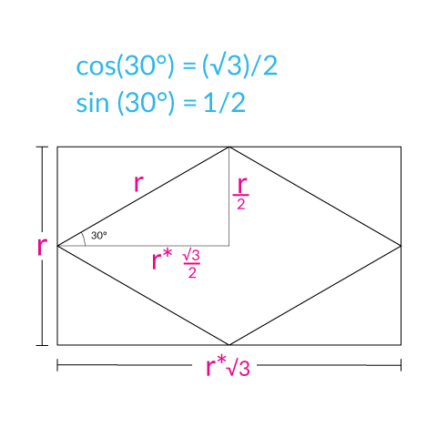
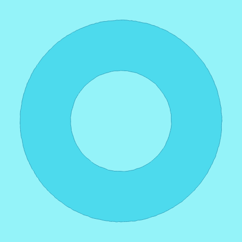

Hi there! I'm an artist and maker living in Los Angeles, you can visit my main website at [wolfCatWorkshop.com](https://wolfcatworkshop.com). 

This is a collection of sketches where I explore coding that creates images I find interesting. I'm not an expert so [comments and suggestions](https://wolfcatworkshop.com/index.php/contact/) are always welcome. 

## Makevember Sketches

Makevember is a challenge to make one thing everyday in November. There is a longer [manifesto](https://www.bricolage.run/blog/2018/10/31/makevember-manifesto-2018) you should read but in short it proposes:

> **Every day in November make a thing** – if you can’t do it every day then do what you can, but the idea is to push yourself to work daily   and with less procrastination. Do not attempt to put your ducks in a row first.

In 2017 I made a bunch of little handcranked machines I documented [here](https://wolfcatworkshop.com/index.php/portfolio/one-month-small-machines/) but in 2018 I wanted to get a little bit out of my confort zone and explore some creative coding. You can also find some of these images and what I did with them on my [twitter](https://twitter.com/wolfCatWorkshop) or [instagram](https://www.instagram.com/wolfcatworkshop/).

I'm only posting screen grabs here so click on the image or link to see the actual sketch.

### Day 1
[](./makevember/day-1/)

[sketch](./makevember/day-1/)

A simple set of overlaping grids, the color palette here is inspired by old school risographs. I also drew a second shape with a slight offset and transparency to simulate the charming missalignment of those machines. 

```js
//palette
yellow          = color(255, 232,   0);
mediumBlue      = color( 50,  85, 164);
fluorescentPink = color(255,  72, 176);
```


### Day 2
[](./makevember/day-2/)

[sketch](./makevember/day-2/)

I struggled a bit with the bezierVertex function to make the blinking eyelids, but I did it at the end. The palette was inspired by baby mario from "Super Mario World 2: Yoshi's Island", I found [this](https://www.instagram.com/p/BgCcOKAlmog/) color wheel on the [gamecolor wheel](https://www.instagram.com/gamecolorwheel/) instagram account.  

```js
//palette
brown      = color('#49443e'); 		
blackish   = color('#080603');		
redOrange  = color('#f4401e');		
darkOrange = color('#f69004');	  
offWhite   = color('#f3e7df');	  
```

### Day 3
[](./makevember/day-3/)

[sketch](./makevember/day-3/)

My gif export was a little clunky, check out the [sketch page](./makevember/day-3/) for a better experience. I started by trying to recreate the classic [overlapping circle pattern](https://en.wikipedia.org/wiki/Overlapping_circles_grid) on a hexagonal grid but when I started changing the radius of the circles crazy patterns started showing up. So I added a little slider to navigate them by multiplying the radius by a certain amount. The starting point of 1 is with the circles tightly packed on the hexagonal grid, but this is an arbitrary choice on my part. 

As a bonus I ended up laser cutting my favorite variation (radius multiplier 2.5), here is an [SVG file](./images/day-3.svg) if you are interested in cutting your own. 

[](https://www.instagram.com/p/Bpvq0yYAtZ1/)
[](https://www.instagram.com/p/Bpvq0yYAtZ1/)

### Day 4
[](./makevember/day-4/)

[sketch](./makevember/day-4/)

A simple pattern navigator that works by placing polygons on a square grid. You can change the radius and the number of sides with some sliders. I wanted to add SVG export so I'm using [this p5 SVG library](https://github.com/zenozeng/p5.js-svg), it requires and older version of p5js so I couldn't use the same technique for placing the SVG canvas inside a DIV that I used on the other sketches so the page doesn't look as neat, but the SVG download works. 

I think the most amusing patterns are made by the octagons. Polygons with a larger number of sides are very close to a circle, and some of the other ones like triangles and hexagons probably look better on a hexagonal grid. 

I also cut something with my favorite variation, here is an [SVG file](./images/day-4.svg) for this one.

[](https://www.instagram.com/p/BpyAJbUA5lN/)


### Day 5
[](./makevember/day-5/)

[sketch](./makevember/day-5/)

I wanted lots of eyes. I think a sort of monster is kind of taking shape everytime you redraw the canvas. Same palette as day 2.

```js
//palette
brown      = color('#49443e'); 		
blackish   = color('#080603');		
redOrange  = color('#f4401e');		
darkOrange = color('#f69004');	  
offWhite   = color('#f3e7df');	  
```

### Day 6
[](./makevember/day-6/)

[sketch](./makevember/day-6/)

Another "pattern explorer" using only radial symmetry and ellipses. This time I used the [quicksettings library](https://github.com/bit101/quicksettings) for the user interface, boy does it make life easy if you want lots of sliders and buttons, it looks fairly clean too. 

### Day 7
[](./makevember/day-7/)

[sketch](./makevember/day-7/)

Quite similar to day 4 except now I'm placing the polygons on a hexagonal grid. Hexagons create really pretty patterns and there are some interesting shapes that come out of non-multiples of 3 like pentagons and heptagons. Still using [quicksettings.js](https://github.com/bit101/quicksettings) for the user interface. 

To create the distance for placing things on a hexagonal grid (or triangle grid if you wish) I'm using this idea:


Given a circle with radius(r), the horizontal distance between circles is the diameter(d). Every other row is horizontally offset by the radius(r) and vertically offset by the sine of 60 degrees scaled by the diameter(d). Then I use a nested for loop to draw 2 shapes per x and y positions, effectively using a square grid to draw a hexagonal grid. There is probably a better way, but this is what my brain came up with. Simplified code looks like this:

```js
  
  var radius   = 20;                       
  var diameter = radius * 2;                    
  var yOffset  = sin(TWO_PI/6) * d;  //vertical offset
  
  //notice that 'x' moves by diameter, and 'y' by twice the vertical offset
  for (var x = 0 ; x <= width; x+= diameter){
   for (var y = 0; y <= height; y+= yOffset * 2){
      ellipse(x, y, diameter);
      ellipse(x + radius, y + yOffset , diameter);
    }
   }
```

### Day 8
[](./makevember/day-8/)

[sketch](./makevember/day-8/)

This one draws a leaf shape on a rectangular grid. You can select shape size, angle, horizontal offset and vertical offset. I also added a checkbox to toggle a simple animation (the shape size oscillates using the sine function). 

### Day 9
[](./makevember/day-9/)

[sketch](./makevember/day-9/)

This sketch allows me to draw a series of concentric arcs with custumizable offsets. It's useful for cutting bendy shapes like the one depicted. Bonus: I used a recursive function!. For a video of how the cut paper behaves look at [this post](https://www.instagram.com/p/Bp_NlwhAzzZ/). 


### Day 10
[](./makevember/day-10/)

[sketch](./makevember/day-10/)

This sketch creates a sort of halftone effect using crosses. The crosses are drawn on a grid where every row is offset from the previous one and a line of symmetry through the center. I'm using perlin noise to change the cross sizes to give them a smooth transition. Unfortunately the SVG library seems to take a fair ammount of resources so I didn't animate the transition, but it's quite amusing if you wanna give it a try.

### Day 11
[](./makevember/day-11/)

[sketch](./makevember/day-11/)

Dipping my toes into a random shape generator that overlaps shapes drawn at random into a grid. I did only ellipses, lines and points to keep it simple and get familiar with the format. 


### Day 12
[](./makevember/day-12/)

[sketch](./makevember/day-12/)

Drawing polygons on a grid with some overlapping lines between the center of each polygon and its vertices. The idea was to make them cuttable while highlighting the triangular insides of each polygon. Another exploration on the shape generator with some symmetry added to it.

### Day 13
[](./makevember/day-13/)

[sketch](./makevember/day-13/)

I've been making pretty rigid grids so far so I was thinking it would be nice to make a sort of "woobly" grid. This is the incarnation at is very basic. I'm drawing quads because I can specify a random variation for each point. Going crazy on the random values creates an amusing animation.

### Day 14
[](./makevember/day-14/)

[sketch](./makevember/day-14/)

This one was inspired by this [Tweet](https://twitter.com/jbeda/status/928477822779142144) and a [paper.js sketch](http://sketch.paperjs.org/#V/0.11.8/S/fZJhT8MgEIb/CiExg9GsTI1bOv3kHzDxo/UDtudK2oJhOGOa/neP0nVTpyQkx73vHTwXOmpUCzSjjzX4oqIJLWwZznvlSPv5oHxF7oiBDxJCxje5idnFzjtbw71trEPHzEE5QzE3obAA48EdCq02nl1LmeDm0WDe2yG9Q8+llEPhKzZiGhNyQzS5PXrwKAQnXW4IrlC+h8Lb7/1HNSxltg1khF3dyHTF50xfrHhylBswW19leMecLGO6D1whGNlUWbKRQYyX4cP78Mo0PTeWk/wfg0H9J+A6gnWD+D/aaDhHxzSPfCeeA+I0QrGUk6HnU/gLV0yw6EBe/A8vDlT9NnSh2dNz/wU=). I expanded the idea just a little bit by making it possibe to choose the number of sides. 

### Day 15
[](./makevember/day-15/)

[sketch](./makevember/day-15/)

I didn't have a lot of time but I made a symmetric grid where the rectangles are a tiny bit bigger than the spacing and are generated at random, this creates some interesting trails in an otherwise very "space invaders" looking animation.

### Day 16
[](./makevember/day-16/)

[sketch](./makevember/day-16/)

I was exploring four corner symmetry. Nothing too fancy since I had a long day at work. But the trick here is to draw the same rectangle four times, for left/right symmetry use x and (width -x); and for top/bottom use y and (height-y).

```js
  rect(x, y, size, size);                  // top left
  rect(width - x, y, size, size);          // top right
  rect(x, height - y, size, size);         // bottom left 
  rect(width - x, height - y, size, size); // bottom right
 
```
### Day 17
[](./makevember/day-17/)

[sketch](./makevember/day-17/)

I was reading the [wikipedia entry on sine](https://en.wikipedia.org/wiki/Sine) and I found the angles for which the values of sine are [particularly simple](https://en.wikipedia.org/wiki/Exact_trigonometric_constants). We can use that simplicity when writing code to calculate the ratio of certain grids, like a [hexagonal lattice](https://en.wikipedia.org/wiki/Hexagonal_lattice) that can be constructed out of quadrilaterals which are √3 times as high as wide. 

The basic code I wrote to draw that quadrilateral (or rhombus) is:

```js
//draws a rhombus with center at x, y and a given height; the width is √3 times the height
function hquad(x, y, hheight){
  let h = hheight/2;   //half the height
  let w = h * sqrt(3); //half the width
	quad(x, y - h, 
       	x + w, y, 
       	x, y + h, 
       	x - w, y);
  }

```
And the grid can be drawn with two nested for loops that follow a spacing of the same proportions. This image might clarify the idea:



### Day 18
[](./makevember/day-18/)

[sketch](./makevember/day-18/)

More explorations of the hexagonal lattice with √3. The size of the shapes is proportinal with the distance from the focal point. 


### Day 19
[](./makevember/day-19/)

[sketch](./makevember/day-19/)

This was an exercise in using objects that I could update with a button. I create a Node class, and a couple of arrays, populate them 
in setup() and use them to draw a "donut" shape. They have an update function that changes their location by a random ammount. I'm not sure why would you want a crooked donut but here it is. Palette is from [this image](https://ello.co/cosmicnuggets/post/udreakztgdn8i6h9xnoaga) by [cosmic nuggets](https://www.instagram.com/cosmicnougat/). Colors extracted using https://palettegenerator.com/ and I created the GIF with https://ezgif.com/ which is my favorite tool so far. 

```js
//palette
background = color('#94F3F9'); 		
fill       = color('#4DDAED');		
stroke     = color('#33A3BD');		
 
```

### Day 20
[](./makevember/day-20/)

[sketch](./makevember/day-20/)

I wanted to implement a version of [Truchet tiles](https://en.wikipedia.org/wiki/Truchet_tiles). So nothing complicated except for an excuse to practice some object oriented programming. 


### Day 21
[](./makevember/day-21/)

[sketch](./makevember/day-21/)

With a small modification the previous sketch turned into the quarter-circles version of Truchet tiles.

